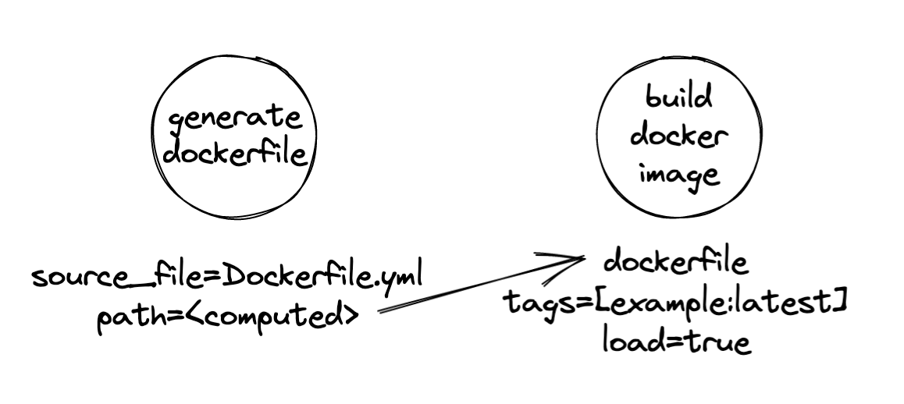

# kraken-core

[](https://github.com/kraken-build/kraken-core/actions/workflows/python-package.yml)
[](https://badge.fury.io/py/kraken-core)

The `kraken.core` package provides the primitives of describing a build and deriving build tasks.

Aside from the `kraken.core` package, this package also provides the `kraken.api` module that is
used only at runtime by Kraken build scripts and the `kraken.testing` module for Pytest fixtures.

## How does it work?

Kraken uses **tasks** to describe units of work that can be chained and establish dependencies between each other.
Each task has a **schema** that defines its input and output properties. When an output property is linked to the
input property of another task, this established as dependency between the tasks.

```py
from kraken.std.docker_gen import generate_dockerfile
from kraken.std.docker_build import build_docker_image
dockerfile = generate_dockerfile(source_file="Dockerfile.yml")
build_docker_image(dockerfile=dockerfile.path, tags=["example:latest"], load=True)
```

This populates the project with two **tasks** and connects the computed output property of one to the other,
allowing the tasks that will run for `build_docker_image()` to pick up the dynamically generated Dockerfile that
is written into a location in the build directory by the `generate_dockerfile()` task.

<p align="center"></p>

## Core API

Kraken **tasks** are described with a schema. Each schema field has a type and may be an input or output parameter.
Output parameters are only available once a resource is executed; Kraken will that a proper execution order is
established such that output properties are hydrated before another resource tries to access them as an input.

```py
from kraken.core.task import Context, Task, Property, Output, task_factory
from typing_extensions import Annotated

class GenerateDockerfileTask(Task):
    source_file: Property[str]
    path: Annotated[Property[str], Output]

    def execute(self, ctx: Context) -> None:
        path = Path(self.path.setdefault(str(ctx.build_directory / "Dockerfile")))
        path.write_text(render_dockerfile(Path(self.source_file.get()).read_text()))

generate_dockerfile = task_factory(GenerateDockerfileTask)
```

### Notes on writing extensions

#### Task properties

The Kraken code base uses the 3.10+ type union operator `|` for type hints where possible. However, special care needs
to be taken with this operator when defining properties on Kraken tasks. The annotations on task objects are eveluated
and will cause errors in Python versions lower than 3.10 when using the union operator `|` even with
`__future__.annotations` enabled.

<table><tr><th>Do</th><th>Don't</th></tr>
<tr><td>

```py
from __future__ import annotations
from typing import Union
from kraken.core.property import Property
from kraken.core.task import Task


class MyTask(Task):
    my_prop: Property[Union[str, Path]]

    def _internal_method(self, value: str | Path) -> None:
        ...
```

</td><td>


```py
from __future__ import annotations
from typing import Union
from kraken.core.property import Property
from kraken.core.task import Task


class MyTask(Task):
    my_prop: Property[str | Path]  # unsupported operand type(s) for |: 'type' and 'type'

    def _internal_method(self, value: str | Path) -> None:
        ...
```

</td></tr>
</table>

Also note that properties use "value adapters" to validate and coerce values to the property value type. Depending on
the order of union types, this may change the semantics of the value stored in a property. For example, the value
adapter for the `pathlib.Path` type will convert strings to a path object. If your property accepts both of these
types, putting the `str` type first in the union will ensure that your property keeps the string a string instead of
coercing it to a path.

## Integration testing API

The `kraken.testing` module provides Pytest fixtures for integration testing Kraken extension modules. The
`kraken_project` fixture provides you with access to a Kraken project object. The `kraken.testing.execute()`
function is a rudimentary implementation to correctly execute a build graph, but it is not recommended for
production use and should be used in tests only.

__Example__

```py
def test__helm_push_to_oci_registry(kraken_project: Project, oci_registry: str) -> None:
    """This integration test publishes a Helm chart to a local registry and checks if after publishing it, the
    chart can be accessed via the registry."""

    helm_settings(kraken_project).add_auth(oci_registry, USER_NAME, USER_PASS, insecure=True)
    package = helm_package(chart_directory="data/example-chart")
    helm_push(chart_tarball=package.chart_tarball, registry=f"oci://{oci_registry}/example")
    kraken_project.context.execute([":helmPush"])
    response = httpx.get(f"http://{oci_registry}/v2/example/example-chart/tags/list", auth=(USER_NAME, USER_PASS))
    response.raise_for_status()
    tags = response.json()
    assert tags == {"name": "example/example-chart", "tags": ["0.1.0"]}
```

> This is a working example from the `kraken-std` package.
